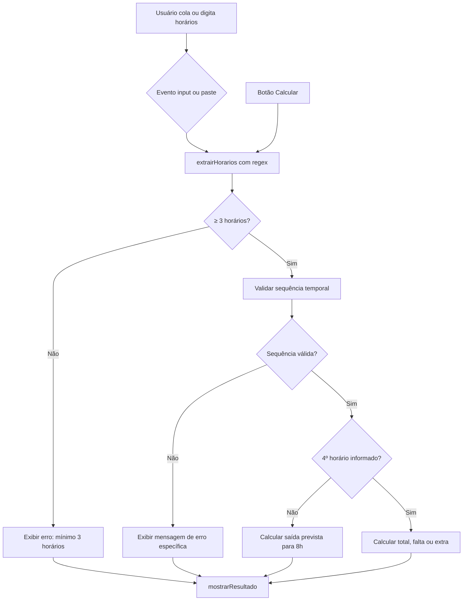
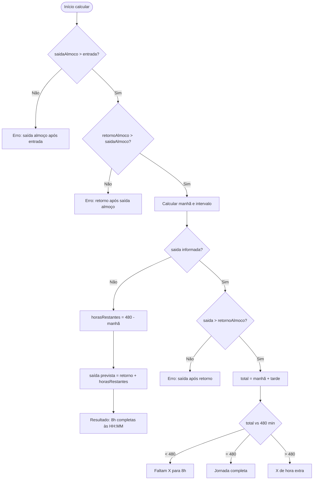
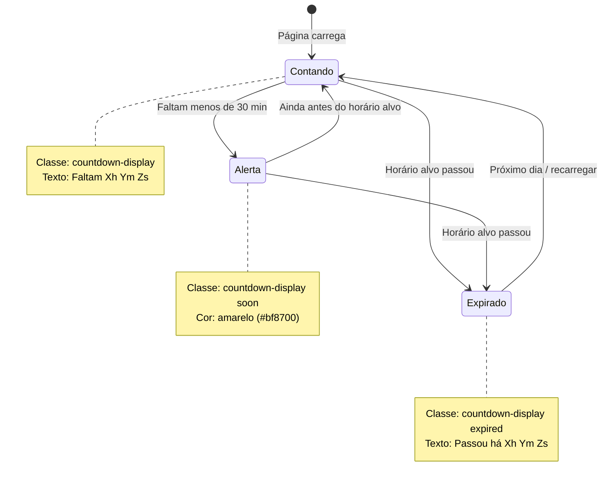
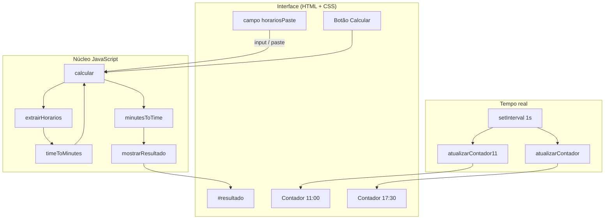
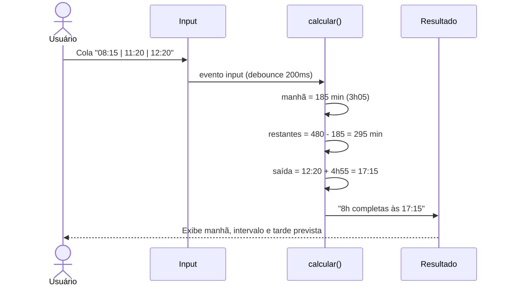

# Calculadora de Horas Trabalhadas

Ferramenta web para calcular a jornada diária a partir de marcadores de ponto. Informe entrada, intervalo de almoço e saída para saber quanto já trabalhou, quando completar 8 horas ou se há horas extras.


## Índice

- [Sobre o projeto](#sobre-o-projeto)
- [Funcionalidades](#funcionalidades)
- [Como usar](#como-usar)
- [Fluxo da aplicação](#fluxo-da-aplicação)
- [Regras de cálculo](#regras-de-cálculo)
- [Contadores em tempo real](#contadores-em-tempo-real)
- [Instalação e execução](#instalação-e-execução)
- [Estrutura do projeto](#estrutura-do-projeto)
- [Arquitetura](#arquitetura)
- [Tecnologias](#tecnologias)
- [Exemplos](#exemplos)
- [Limitações conhecidas](#limitações-conhecidas)
- [Roadmap](#roadmap)
- [Autores](#autores)

## Sobre o projeto

Aplicação de página única que lê horários copiados do ponto e retorna:

- Tempo trabalhado de manhã e à tarde
- Duração do intervalo de almoço
- Horário previsto para completar 8 horas, quando a saída ainda não foi registrada
- Saldo de horas faltantes ou extras, quando a saída já foi informada

Roda no navegador, sem instalação e sem dependências externas.

## Funcionalidades

| Recurso | Descrição |
|---------|-----------|
| Entrada flexível | Aceita `HH:MM` ou `HH:MM:SS`, separados por `\|`, `-` ou espaços |
| Cálculo automático | Atualiza o resultado ao colar ou digitar |
| Previsão de saída | Com 3 horários, calcula quando completar 8h |
| Balanço da jornada | Com 4 horários, mostra total, falta ou hora extra |
| Validações | Bloqueia sequências inválidas de horários |
| Contadores | Tempo restante ou decorrido até 11:00 e 17:30 |
| Layout responsivo | Funciona em desktop e mobile |

## Como usar

1. Abra o arquivo `index.html` no navegador.
2. Cole os marcadores de ponto no campo de entrada.
3. O resultado aparece automaticamente. Também dá para clicar em **Calcular**.

### Formato de entrada

```
08:15:56 | 11:19:48 | 12:20:44
```

ou

```
08:15 11:19 12:20 17:45
```

### Ordem dos horários

| Posição | Significado | Obrigatório |
|---------|-------------|-------------|
| 1º | Entrada | Sim |
| 2º | Saída para almoço | Sim |
| 3º | Retorno do almoço | Sim |
| 4º | Saída final | Não |

## Fluxo da aplicação

O diagrama abaixo resume o caminho desde a entrada do usuário até a exibição do resultado:



> **Nota:** `extrairHorarios()` descarta os segundos informados na entrada e mantém apenas `HH:MM`.

## Regras de cálculo

A jornada padrão é de **8 horas (480 minutos)** de trabalho efetivo. O intervalo de almoço não entra no total; ele separa manhã e tarde.

### Linha do tempo da jornada

Manhã e tarde entram no total trabalhado. O intervalo entre saída e retorno do almoço é excluído do cálculo.

```mermaid
gantt
    title Exemplo: 08:15 → 11:20 → 12:20 → 17:30
    dateFormat HH:mm
    axisFormat %H:%M

    section Manhã (conta)
    Trabalho manhã     :active, manha, 08:15, 11:20

    section Intervalo (não conta)
    Almoço             :crit, almoco, 11:20, 12:20

    section Tarde (conta)
    Trabalho tarde     :active, tarde, 12:20, 17:30
```



### Fórmulas

```
Horas manhã      = Saída almoço - Entrada
Horas tarde      = Saída - Retorno almoço
Total trabalhado = Horas manhã + Horas tarde
```

Se a saída não for informada, a tarde é calculada para fechar 8 horas:

```
Horas restantes = 480 - Horas manhã
Saída prevista  = Retorno almoço + Horas restantes
```

Com 4 horários informados:

- Total menor que 8h: mostra quanto falta
- Total igual a 8h: jornada completa
- Total maior que 8h: mostra horas extras

### Lógica de cálculo



## Contadores em tempo real

| Contador | Horário alvo |
|----------|--------------|
| Tempo até 11:00 | 11:00 |
| Tempo até 17:30 | 17:30 |

Os contadores atualizam a cada segundo. O botão **⟳** força a atualização manual. Quando faltam menos de 30 minutos, o texto muda de cor. Depois do horário alvo, mostra quanto tempo já passou.

### Estados dos contadores



## Instalação e execução

### Pré-requisitos

Navegador moderno (Chrome, Firefox, Edge ou Safari).

### Execução local

Abrir o arquivo diretamente:

```bash
# Windows
start index.html

# macOS
open index.html

# Linux
xdg-open index.html
```

Servidor local, se preferir:

```bash
# Python 3
python -m http.server 8080

# Node.js
npx serve .
```

Acesse `http://localhost:8080`.

Não há build, bundler nem instalação de pacotes.

## Estrutura do projeto

```
calculadora-horas/
├── index.html
└── README.md
```

Tudo fica em um único arquivo HTML, com CSS e JavaScript embutidos.

## Arquitetura

A aplicação é monolítica (um único `index.html`), mas separada em camadas lógicas:



## Tecnologias

- HTML5
- CSS3
- JavaScript (ES6+)

### Funções principais

| Função | Responsabilidade |
|--------|------------------|
| `extrairHorarios()` | Extrai horários no formato `HH:MM` ou `HH:MM:SS` |
| `timeToMinutes()` | Converte horário para minutos |
| `minutesToTime()` | Converte minutos para `HH:MM` |
| `calcular()` | Valida entrada e monta o resultado |
| `atualizarContador()` | Contador até 17:30 |
| `atualizarContador11()` | Contador até 11:00 |

## Exemplos

### Previsão de saída (3 horários)

Entrada: `08:15 | 11:20 | 12:20`

| Período | Duração |
|---------|---------|
| Manhã | 03:05 |
| Intervalo | 01:00 |
| Tarde | 04:55 |

Resultado: 8h completas às **17:15**.

#### Sequência do cálculo



### Jornada com saída (4 horários)

Entrada: `08:15 | 11:20 | 12:20 | 17:30`

| Período | Duração |
|---------|---------|
| Manhã | 03:05 |
| Tarde | 05:10 |
| Total | 08:15 |

Resultado: **00:15** de hora extra.

### Entrada inválida

Entrada: `11:00 | 08:00 | 12:00`

Resultado: *"O horário de saída para almoço deve ser após a entrada."*

## Limitações conhecidas

- Jornada fixa de 8 horas; não há configuração de carga horária personalizada
- Horários alvo dos contadores (11:00 e 17:30) estão fixos no código
- Não persiste dados (sem localStorage ou backend)
- Não considera virada de dia (turnos noturnos)
- Segundos informados na entrada são ignorados no cálculo (usa apenas horas e minutos)

## Roadmap

- [ ] Campo configurável para carga horária diária (6h, 8h, etc.)
- [ ] Horários alvo dos contadores editáveis pelo usuário
- [ ] Persistência local dos últimos horários colados
- [ ] Modo escuro
- [ ] Exportar resumo do dia (copiar / PDF)
- [ ] Suporte a múltiplas jornadas no mesmo dia

## Autores

- [@aron-alvarenga](https://github.com/aron-alvarenga/)
- [@silviofrancomms10](https://github.com/silviofrancomms10/)
